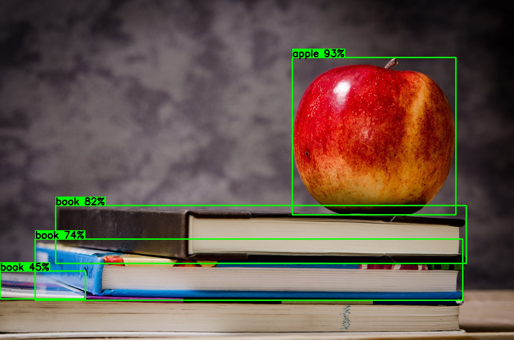

# YOLOv9 C++ Inference with ONNX Runtime

YOLOv9 object detection framework in C++, with weights loaded in `.onnx` format. The pipeline covers full preprocessing (letterboxing, normalization, CHW conversion), inference via **ONNX Runtime**, and postprocessing (coordinate remapping + NMS), outputting annotated images with bounding boxes and confidence scores.

Supports all **80 COCO classes**

---

## Dependencies

| Library | Purpose |
|---|---|
| [ONNX Runtime](https://github.com/microsoft/onnxruntime) | Model inference |
| [OpenCV](https://opencv.org/) | Image I/O, preprocessing, drawing, NMS |
| C++17 | `std::filesystem` support |

> Tested on **Ubuntu** (v. 13.3.0) via WSL on Windows.

---

## Project Structure

```
yolov9-cpp/
├── assets/                   
│   └── ...                       # Example images of the result 
├── build/
│   ├── detect                    # Compiled executable
│   └── ..                        # CMake generated files
├── images/
│   ├── inputs/                   # Input images here (dataset preloaded)
│   └── outputs/                  # Results are saved here
├── onnxruntime-linux-x64-1.17.0/ # ONNX Runtime prebuil
│   ├── include/
│   ├── lib/
│   └── ... 
├── YOLOv9/
│   ├── YOLOv9.cpp              
│   └── YOLOv9.h  
├── CMakeLists.txt
├── main.cpp
├── README.md
└── yolov9-m-converted.onnx       # Model weights 
```
---

## Installation & Build

### 1. Clone the repository

```bash
git clone https://github.com/lolabenavides/YOLOv9-cpp.git
cd yolov9_cpp
```

### 2. Install dependencies

**OpenCV:**
```bash
sudo apt update
sudo apt install libopencv-dev
```

**ONNX Runtime** — download the pre-built Linux x64 package from the [official releases](https://github.com/microsoft/onnxruntime/releases) and extract it:
```bash
tar -xzf onnxruntime-linux-x64-<version>.tgz
```
Then update the path in `CMakeLists.txt` to point to your extracted folder.


### 3. Build with CMake

```bash
mkdir build && cd build
cmake ..
cmake --build .
```

---

## Usage

1. Place your input images inside `images/inputs/`.
2. Run the executable from the `build/` directory:

```bash
./detect
```

3. Annotated results are saved automatically to `images/outputs/`.

**Example console output:**
```
Processing: dog.jpg
Saved in: ../images/outputs/dog.jpg (3 detections). 805.234 ms | FPS: 1.24188
Processing: street.png
Saved in: ../images/outputs/street.png (11 detections). Latency: 828.967 ms | FPS: 1.20632
Finished. 2 processed images.
Total time: 0.087 s.
```

---

## Example Output


<div align="center">
    <a href="./">
        
    </a>
</div>


| Input | Output |
|---|---|
||  |

---

## Configuration

Key parameters can be adjusted directly in the source files:

| Parameter | Location | Default | Description |
|---|---|---|---|
| `conf_threshold` | `YOLOv9.cpp` | `0.25` | Minimum confidence to keep a detection |
| `nms_threshold` | `YOLOv9.cpp` | `0.45` | IoU threshold for Non-Maximum Suppression |
| `onnx_path` | `main.cpp` | `../yolov9-m-converted.onnx` | Path to the model weights |
| `input_folder` | `main.cpp` | `../images/inputs/` | Folder with input images |
| `output_folder` | `main.cpp` | `../images/outputs/` | Folder where results are saved |

---

## How It Works

1. **Preprocessing** — Letterboxing (resized to 640×640 while preserving the aspect ratio), BGR→RGB conversion, normalization to `[0, 1]`, and HWC→CHW layout for the tensor.
2. **Inference** — the tensor is passed to ONNX Runtime, which runs the YOLOv9 model.
3. **Postprocessing** — raw outputs are decoded, letterbox padding is undone to recover original coordinates, and NMS removes duplicate boxes.
4. **Annotation** — bounding boxes and labels are drawn and the result is saved to disk.
---

### `main.cpp`

It handles the overall execution flow:

1. Defines the paths to the `.onnx` model, the input folder and the output folder.
2. Instantiates the `YOLOv9` class, loading the model weights.
3. Iterates over all files in the input folder, filtering by valid image extensions.
4. For each image:
   - Reads it with `cv::imread`.
   - Calls `model.preprocess()` to prepare the image tensor.
   - Calls `model.inference()` to run the model and get the detections.
   - Scales font size and bounding box thickness proportionally to the image resolution.
   - Draws each detection: a rectangle and a label with the class name and confidence percentage.
   - Saves the annotated image to the output folder with `cv::imwrite`.
5. Prints per-image latency and FPS, and a final summary with total processing time.

---

### `YOLOv9.h`

Defines the data structures and the `YOLOv9` class interface:

- **`Detection`** — holds the result of a single detection: `class_id`, `confidence`, and `box` (`cv::Rect`).
- **`LetterboxInfo`** — stores the `scale` factor and the `pad_x`/`pad_y` offsets applied during letterboxing, needed to reverse the transformation in postprocessing.
- **`YOLOv9` class** — exposes two public methods (`preprocess` and `inference`) and keeps the ONNX Runtime session objects (`Env`, `SessionOptions`, `Session`) as private members, along with the fixed input dimensions (640×640).

---

### `YOLOv9.cpp`

Contains the implementation of the three core functions:

**`letterbox()`** : Resizes the input image to fit within 640×640 while preserving the aspect ratio. The remaining area is filled with padding. The scale factor and padding offsets are stored in a `LetterboxInfo` struct so they can be used later to map detections back to the original image coordinates.

**`preprocess()`** : Prepares the image for inference:
1. Calls `letterbox()` to resize and pad the image.
2. Converts from BGR (OpenCV default) to RGB.
3. Normalizes pixel values from `[0, 255]` to `[0.0, 1.0]`.
4. Converts the layout from HWC *(Height × Width × Channels)* to CHW *(Channels × Height × Width)*, as expected by the model.
5. Returns a flat `std::vector<float>` ready to be fed into the ONNX tensor.

**`inference()`** : Runs the model and returns the final detections:
1. Wraps the preprocessed data into an ONNX Runtime input tensor of shape `[1, 3, 640, 640]`.
2. Runs the session and measures inference latency using `std::chrono`.
3. Reads the output tensor of shape `[1, 84, 8400]`: 4 box coordinates + 80 class scores, across 8400 candidate boxes.
4. For each candidate, finds the class with the highest confidence score. Boxes below the confidence threshold (`0.25`) are discarded.
5. Reverses the letterbox transformation to map coordinates back to the original image space, and clamps them to the image boundaries.
6. Applies **Non-Maximum Suppression (NMS)** via `cv::dnn::NMSBoxes` (IoU threshold: `0.45`) to remove duplicate detections.
7. Returns the final `std::vector<Detection>`.
